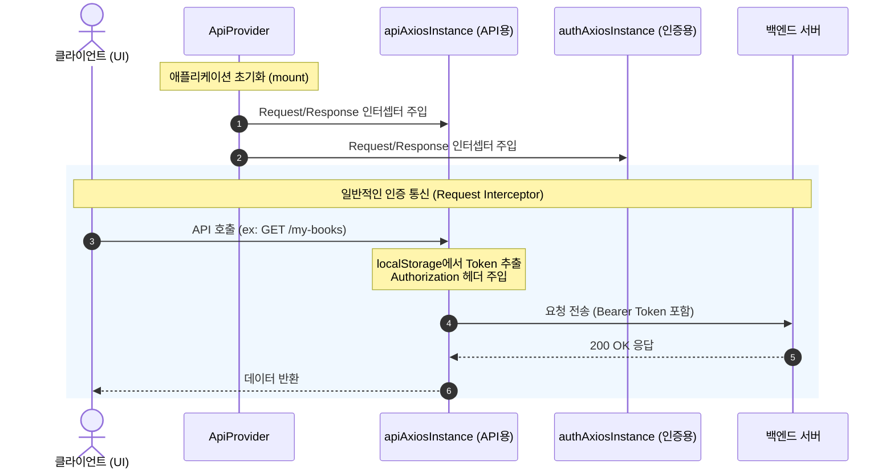
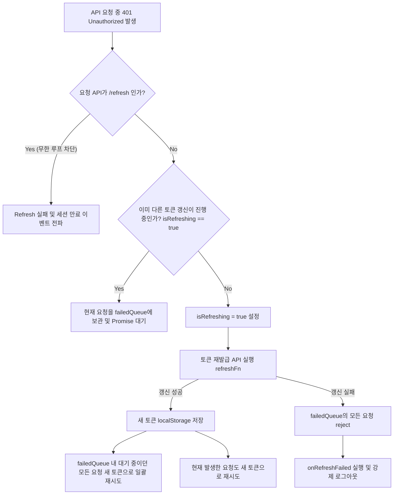

# ApiProvider (API 인증 및 통신 라이프사이클 프로바이더)

`ApiProvider`는 Next.js 애플리케이션 내의 모든 HTTP 통신 과정에서 **인증 토큰(AccessToken) 주입, 만료 시 자동 재발급(Silent Refresh), 동시 다발적 API 요청 대기(Queueing)** 등의 복합적인 인증 로직을 전역에서 제어하고 초기화하기 위한 프로바이더 컴포넌트입니다.

---

## 1. 개요 및 설계 아키텍처

애플리케이션이 구동되면 `ApiProvider`는 서버 통신용 Axios 인스턴스(`apiAxiosInstance`, `authAxiosInstance`)에 요청 및 응답 인터셉터를 동적으로 바인딩합니다. 

특히 FSD(Feature-Sliced Design) 아키텍처에서 API 모듈의 독립성을 보장하면서, 클라이언트 환경(Browser)의 생명주기에 따라 인터셉터를 등록하고 언마운트 시점에 회수(`eject`)하는 중요한 게이트웨이 역할을 수행합니다.

### 시스템 협력 관계 및 데이터 흐름



---

## 2. 핵심 기능 상세 설명

### ① 전역 API 인스턴스 관리
애플리케이션 내 통신용 Axios 인스턴스는 성격에 따라 2가지로 구분되며, `ApiProvider`가 각각에 최적화된 인터셉터를 주입합니다.

* **`apiAxiosInstance`**: 일반 비즈니스 데이터(책 검색, 독서 기록 등)를 다루는 API 인스턴스입니다.
* **`authAxiosInstance`**: 로그인, 회원가입, 토큰 갱신(`/api/auth/refresh`) 등 인증 전용 API 인스턴스입니다.

### ② 요청 인터셉터 (Request Interceptor)
* **역할**: 클라이언트 사이드(`window` 객체가 존재할 때)의 `localStorage`에서 `accessToken`을 탐색합니다.
* **동작**: 토큰이 존재하면 모든 아웃고잉(outgoing) HTTP 요청의 `Authorization` 헤더에 `Bearer {token}` 포맷으로 주입하여 서버가 인가할 수 있도록 돕습니다.

### ③ 자동 토큰 재발급 & 대기 큐잉 (Silent Refresh & Failed Queue)
`apiAxiosInstance`에 바인딩된 응답 인터셉터([api.response.ts](file:///Users/lee-seong-won/Documents/code/book-habit-next/shared/api/interceptors/api.response.ts))의 핵심 메커니즘입니다.

1. **401 Unauthorized 감지**: 액세스 토큰이 만료되어 서버로부터 `401` 상태 코드를 받으면 인터셉터가 작동합니다.
2. **무한 루프 방지**: 실패한 요청의 URL이 토큰 재발급 API인 `/api/auth/refresh`인 경우 즉시 에러를 반환하고 세션 만료 처리를 실행합니다.
3. **동시성 제어 및 요청 대기 큐 (`failedQueue`)**:
   * 토큰 만료 시점에 여러 API가 동시에 호출되면, 첫 번째 에러가 발생한 요청이 `isRefreshing = true` 플래그를 올리며 토큰 갱신 API(`refreshFn`)를 요청합니다.
   * 토큰이 갱신되는 동안 날아오는 다른 API 요청들은 즉시 에러를 반환하지 않고 **`failedQueue`에 담겨 Promise 대기 상태**로 홀딩됩니다.
4. **큐 일괄 처리 (`processQueue`)**:
   * 토큰 갱신에 성공하면 새로운 액세스 토큰을 `localStorage`에 갱신합니다.
   * `failedQueue`에 대기 중이던 모든 API 요청들을 새로운 토큰으로 헤더를 변경하여 다시 서버로 재전송(`resolve`)합니다.
   * 갱신에 완전히 실패하면 대기 중인 모든 요청을 반려(`reject`)하고 세션을 파기합니다.



---

## 3. 리소스 정리 및 안정성 (Cleanup)

`ApiProvider`는 **리액트 컴포넌트 생명주기**에 종속되어 동작합니다. 컴포넌트가 언마운트되거나 리렌더링으로 훅이 정리되는 시점에 반드시 `eject` 함수를 통해 Axios 인스턴스로부터 등록했던 인터셉터들을 해제합니다.

### ⚠️ 중요: 타입 안정성(Type Safety) 패치 내역

인터셉터 등록 함수(`setupRequestInterceptor` 등)는 내부적으로 등록 성공 시 생성된 인터셉터 고유 ID(`number`)를 반환합니다. 이 ID는 컴포넌트 언마운트 시 해제하기 위해 보관해야 합니다.

* **기존의 문제**: 인터셉터 식별자 변수가 `let xxxInterceptor: number | undefined`로 정의되어 있어, 정리 함수(`eject`)에 인자로 전달할 때 `undefined`일 가능성 때문에 TypeScript 빌드 타입 에러가 발생했습니다.
* **개선 사항**: `eject`를 실행하기 전에 해당 변수가 안전하게 `number` 타입으로 할당되었는지 검사하는 조건문 분기를 도입했습니다.
  ```typescript
  return () => {
    if (apiRequestInterceptor !== undefined) {
      apiAxiosInstance.interceptors.request.eject(apiRequestInterceptor);
    }
    // ...
  };
  ```
  이를 통해 빌드 타입을 완벽하게 준수하고, 런타임 상에서 초기화가 덜 된 상태로 소멸할 때 생길 수 있는 에러 가능성을 원천 차단했습니다.

---

## 4. 유지보수 및 확장 가이드

1. **로그인 / 로그아웃 이벤트 처리 변경 시**:
   * 토큰 갱신 및 파기 동작의 핸들러는 `@/entities/auth` 도메인의 `authService` 및 `authEvents`를 참조하고 있습니다. 세션 만료 및 갱신 비즈니스 규격이 변경되면 해당 모듈들을 수정해야 합니다.
2. **새로운 API 인스턴스 추가 시**:
   * 새로운 성격의 Axios 인스턴스(예: 파일 업로드 전용 등)가 생성될 경우, `ApiProvider` 내 `useEffect` 블록 내부에 동일한 인터셉터 등록 로직을 연결해주고 `cleanup` 함수에도 `eject` 식별자 처리를 빼놓지 않고 추가해주어야 합니다.
